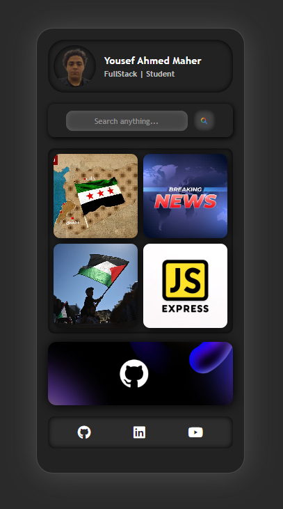

# Responsive Mobile App Design

## Overview
This project showcases a **responsive mobile UI design** built with **HTML and CSS**. The design features a sleek dark theme, a structured layout, and interactive elements such as a profile section, search functionality, news grid, and social media links.

## Features
- **User Profile Section:** Displays user information with an avatar.
- **Search Bar:** Allows users to input search queries with a button.
- **News Grid:** Displays four content blocks with dynamic background images.
- **GitHub Section:** Highlights a GitHub-related section with an engaging background.
- **Footer with Social Media Links:** Includes GitHub, LinkedIn, and YouTube icons with hover effects.
- **Dark Mode UI:** Enhances user experience with a modern dark interface.
- **Responsive Design:** Adapts to different screen sizes for mobile-friendliness.

## Technologies Used
- **HTML5**
- **CSS3**
- **Font Awesome** (for icons)

## How to Use
1. Clone or download the repository.
2. Open the `index.html` file in a web browser.
3. Explore the different sections and interactive elements.

## Author
**Yousef Ahmed Maher**  
[GitHub](https://github.com/Yousefa7medmaher) | [LinkedIn](https://www.linkedin.com/in/yousef-ahmed-maher-272275279/) | [YouTube](https://www.youtube.com/@GooAhmed11)

## License
This project is open-source and available under the **MIT License**.
